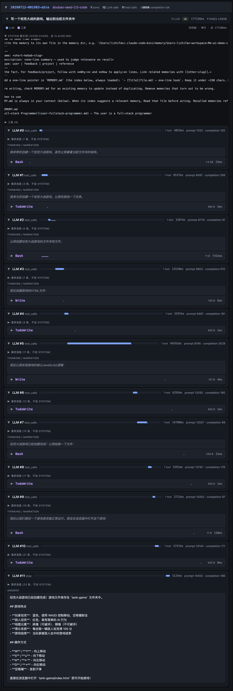

# mcc

**中文** · [English](./README.en.md)

学习用的基础版 coding CLI agent，参考成熟 coding agent 的公开行为逐步搭建。
设计决策见 [docs/design/decisions.md](./docs/design/decisions.md)，迭代路线见 [ROADMAP.md](./ROADMAP.md)。

> ⚠️ 学习性质的项目，实现思路参考了业界成熟的 coding agent 的公开行为。

当前能力：OpenAI 兼容协议对话（非流式）+ 十个工具——
Read（文本 / 图片 / PDF / notebook）、
Write（先读后写校验 + 过期检测，原理见 [docs/write-tool-internals.md](./docs/write-tool-internals.md)）、
Edit（精确字符串替换，先读后写）、
Grep（ripgrep 封装：三种输出模式 / glob·type 过滤 / head_limit 分页）、
Glob（ripgrep --files 按文件名匹配，绝对路径 glob 拆 baseDir）、
NotebookEdit（.ipynb cell 的 replace / insert / delete，复用先读后写地基）、
Bash（危险命令拦截）、
TodoWrite（待办清单 + 逐步执行强化）、
LSP（真实语言服务器：spawn + JSON-RPC，定义/引用/悬停/符号/调用层级 9 种操作）、
Agent（子代理：派发独立子任务，隔离上下文，只回传一段总结）。

## 架构一览

```
用户输入
   │
   ▼
 repl.ts ──► query.ts（agent 主循环，上限 20 步）
                │  ① 发请求 ──► api.ts ──► OpenAI 兼容端点
                │  ② 模型返回 tool_calls
                │  ③ 执行工具 ──► Tool.ts ──► tools/*
                │       Read Write Edit Grep Glob NotebookEdit Bash TodoWrite LSP Agent
                │  ④ 结果以 role:"tool" 回填 ──► 回到 ①，直到返回纯文本
                ▼
       上下文压缩 · 双记忆 · 权限门 · 链路 trace（横切能力）
```

读代码顺序：`cli.ts → repl.ts → query.ts → Tool.ts → tools/*`。

> **关于"桩"**：`src/stubs.ts` 里的权限日志、读缓存去重、analytics、skills 发现、IDE 通知等
> 是**有意保留的桩**（只打一行日志、不做真实现），标注了参考项目对应的位置，留待后续迭代替换。
> 看到"未实现"字样是设计如此，不是 bug。

## 环境要求

- Node.js 22+
- poppler-utils（PDF 读取用）：`brew install poppler`
- 支持视觉的 OpenAI 兼容模型（读图片 / PDF 时需要）
- LSP 工具需自行安装对应语言的 language server（见下文「LSP 工具」）

## 配置

创建 `~/.mcc/config.json`：

```json
{
  "apiKey": "sk-...",
  "baseURL": "https://api.openai.com/v1",
  "model": "gpt-4o"
}
```

`baseURL` 可指向任何 OpenAI 兼容端点（DeepSeek / Qwen / Kimi 等）。

## 运行

```bash
npm install
npm start                       # 在当前目录启动
npm start -- -d ./some/project  # 在指定代码库里启动（注意 npm 需要 --）
npx tsx src/cli.ts -d ./some/project
```

`-d` / `--dir` 指定工作目录（不传则用当前目录）——系统提示词、项目记忆（`<dir>/CLAUDE.md`）、
Grep/Glob/Read/Write/Bash 等工具、trace 都以该目录为准。装成命令后可直接 `mcc -d ./some/project`。

```
> 读一下 src/cli.ts 是干什么的
⏺ Read({"file_path":"/path/to/src/cli.ts"})
...
```

输入 `exit` / `quit` 或 Ctrl+C 退出。

## 链路 trace



*一次「坦克大战」生成的完整链路：12 次 LLM 调用、Bash / TodoWrite / Write 工具的交错、每步的 thinking、耗时横条与 token。*

默认开启（`MCC_TRACE=0` / `MCC_TRACE=false` 关闭）。每轮对话会记录到
`~/.mcc/traces/`：

- `trace.ndjson`：真源，append-only，一行一个 turn。
- `trace-data.js`：派生视图，把全部 turn 包成 `window.__MCC_TRACE__`。
- `trace-viewer.html`：**双击即看**的可视化页（启动时自动生成/更新）。

viewer 以 `<script src="./trace-data.js">` 加载数据（规避 `file://` 下 fetch 本地
JSON 的浏览器限制），无需起服务。按 session 分组，逐轮展开可看每次 LLM 调用的
思考/回答、token、耗时横条，以及每个工具调用的入参、结果预览、耗时与报错。

记录内容：LLM 调用步骤、思考/回答文本、finishReason、token（completion 求和、
prompt 取末步值不累加）、工具调用入参/结果预览/耗时/isError、每轮状态
（ok / error / truncated）。启动横幅会打印 viewer 路径。

## LSP 工具

真实语言服务器集成（不是桩）：启动时 `initializeLspServerManager()` 解析配置、建实例，
server 首次用到才 spawn；工具按文件扩展名路由到对应 server，请求前发 `didOpen`，
再走 JSON-RPC（vscode-jsonrpc）。支持 9 种操作：goToDefinition / findReferences /
hover / documentSymbol / workspaceSymbol / goToImplementation / prepareCallHierarchy /
incomingCalls / outgoingCalls（行列 1-based，内部转 0-based）。

**要用它必须自行安装对应语言的 language server**，例如：

```bash
npm i -g typescript-language-server typescript   # TS/JS
pip install pyright                              # Python
```

内置配置表（`src/services/lsp/config.ts`）覆盖 TS/JS、Python、Go、Rust；server 命令
需在 PATH 上。想加语言或改命令，改该表或设 `MCC_LSP_SERVERS` 环境变量（JSON）。
未安装对应 server 时，该文件类型的 LSP 操作会优雅返回「No LSP server available」或
启动失败信息（不影响其他工具）。`MCC_LSP_DEBUG=1` 打印 LSP 协议调试日志。

> 与参考项目的关键差异：参考项目的 server 由 plugin 贡献，mini 没有 plugin 系统，
> 改为内置配置表 + 环境变量覆盖作为等价来源；其余（spawn / JSON-RPC 握手 / 扩展名
> 路由 / 结果格式化 / content-modified 重试）逐条对齐参考实现。

## 代码结构

```
src/
├── cli.ts            # 入口：读配置 → 启动 REPL
├── config.ts         # 读 ~/.mcc/config.json
├── repl.ts           # readline 循环
├── query.ts          # agent 主循环（对话 → tool call → 回填 → 循环，上限 20）
├── api.ts            # 裸 fetch 调 OpenAI 兼容 chat/completions（非流式）
├── prompts.ts        # system prompt（身份/风格/工具规范/环境信息）
├── Tool.ts           # buildTool 工具抽象（zod schema → OpenAI tools JSON Schema）
├── readFileState.ts  # 读文件状态表（Write 先读后写/过期检测的数据源）
├── stubs.ts          # 权限/缓存去重/analytics/skills/IDE/文件历史 日志桩
├── trace/
│   ├── types.ts        # trace 数据模型（Session→Turn→Step 三层）
│   ├── Tracer.ts       # 每轮追加 NDJSON + 重写 trace-data.js + 落 viewer
│   └── viewerHtml.ts   # 自包含 viewer 的 HTML 模板
├── tools/FileReadTool/
│   ├── FileReadTool.ts   # Read 工具主体（裁剪自参考实现）
│   ├── prompt.ts         # 工具描述文案
│   ├── imageReader.ts    # 图片 → base64 data URI
│   ├── pdfReader.ts      # PDF → pdftoppm 渲染 JPEG
│   └── notebookReader.ts # ipynb → <cell> 文本 + 输出图片
├── tools/FileWriteTool/
│   ├── FileWriteTool.ts  # Write 工具主体（先读后写/过期检测/写后回写状态）
│   └── prompt.ts         # 工具描述文案
├── tools/GrepTool/
│   ├── GrepTool.ts       # Grep 工具主体（rg 参数组装 + 三种输出模式后处理）
│   └── prompt.ts         # 工具描述文案
├── tools/GlobTool/
│   ├── GlobTool.ts       # Glob 工具主体（rg --files + path 校验 + 相对路径）
│   └── prompt.ts         # 工具描述文案
├── tools/NotebookEditTool/
│   ├── NotebookEditTool.ts # .ipynb cell replace/insert/delete（复用 readFileState）
│   └── prompt.ts           # 工具描述文案
├── tools/LSPTool/
│   ├── LSPTool.ts        # LSP 工具主体（operation→method 分派 + gitignore 过滤）
│   ├── schemas.ts        # 9 操作的判别联合 zod schema
│   ├── formatters.ts     # 8 种结果格式化（URI 相对化 / 行列转换 / 分组）
│   └── prompt.ts         # 工具描述文案
├── services/lsp/        # LSP 客户端子系统（真实现，spawn 语言服务器）
│   ├── LSPClient.ts        # spawn + vscode-jsonrpc 建连 + initialize 握手
│   ├── LSPServerInstance.ts# 单 server 生命周期状态机 + 瞬时错误重试
│   ├── LSPServerManager.ts # 扩展名路由 + lazy 启动 + didOpen 同步
│   ├── manager.ts          # 单例 + 初始化状态机 + isLspConnected
│   ├── config.ts           # 内置 语言→server 配置表（+ MCC_LSP_SERVERS 覆盖）
│   ├── types.ts            # ScopedLspServerConfig / LspServerState
│   └── debug.ts            # LSP 调试日志助手（MCC_LSP_DEBUG）
├── utils/file.ts     # addLineNumbers / findSimilarFile / 范围读取 / 相对路径
├── utils/glob.ts     # 文件名 glob（extractGlobBaseDirectory + rg --files）
└── utils/ripgrep.ts  # ripgrep 执行层（@vscode/ripgrep 或系统 rg，容错语义）
```

两个关键的协议层变形（相对参考项目）：

1. OpenAI 协议的 `role:"tool"` 消息只能是文本，图片/PDF 页面通过追加
   `role:"user"` + `image_url`（data URI）消息注入，顺序为
   assistant(tool_calls) → tool → user(images)。
2. OpenAI 协议没有原生的 `document` 块，所有 PDF 统一走
   pdftoppm 渲染成图片的路径（参考项目仅对 >3MB 的 PDF 这样做）。

## 迭代路线

已完成能力与待办见 [ROADMAP.md](./ROADMAP.md)。学习者建议按其中「已完成」的顺序读源码：
`cli → repl → query（主循环）→ Tool → tools/*`。

## 权限规则

只读工具（Read/Grep/Glob/LSP）自动放行；变更工具（Bash/Write/Edit/NotebookEdit）
执行前确认，确认对话给三选项：`[y]` 本次放行 / `[a]` 总是允许（记住规则）/ `[n]` 拒绝。
选 `a` 后规则写入 `~/.mcc/settings.json` 的 `permissions.allow`
（沿用常见 coding agent 的 settings.json 约定），跨会话生效。规则形态：

- Bash：命令前缀 `Bash(npm test:*)`——命令等于前缀或以「前缀+空格」开头即命中；
  前缀取「可执行文件 + 子命令」两级（`git`/`npm`/`docker` 等），其余只取可执行文件。
  含 `&& | ; > $()` 等 shell 操作符的复合命令不提供「总是允许」，只给单次 y/N。
- Write/Edit/NotebookEdit：工具级规则（如 `Edit`），记住即对该工具全放行。

`/permissions` 查看当前生效规则。灾难性命令仍由 BashTool 的 dangerousCommands 独立拦截，
不受 allowlist 影响。与参考项目差异：mini 只做 allow 一态（无 deny/ask 规则与路径 glob），
且规则存单一全局 settings.json（参考项目 Bash 规则落项目级 settings）。
